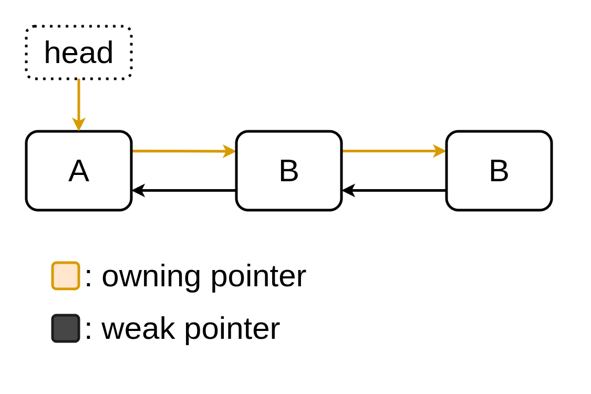

# Guide to Smart Pointers

This will familiarize you with smart pointers in C++ from the ground up. The
problems they solve, the way to think about them as you use them, and how they
can actually make life simpler.

**Note:** If you have more time, I recommend
[this great explainer by David Olsen at CppCon](https://youtu.be/YokY6HzLkXs).
A lot of my intuition, and my subsequent explanations have some roots in his
overview! He also goes into more detail than I will be—in this guide.

## The Problem

What is a pointer? And what is dynamic memory? Simple enough, they both are
related to allocating indeterminate amounts of memory for data, at runtime. A
pointer might hold `nullptr` (no memory), a pointer to a single new object (one
new object), or an array of objects (n objects).

Pointers are actually a bit too flexible, because two pointers can actually
point to the same dynamic object. With this the pointer has too many jobs; it
both keeps track of **memory ownership**, and **weak references** to previous
memory. This is where a lot of our problems come from, and it's where our need
for destructors come from to begin with.

For example, if we have no pointers in our class, the default destructor is
perfect, and how simple is that! But the moment we have a pointer... does it
own the memory it's pointing to? Is it just a reference, and is that memory
owned elsewhere? Are there multiple owners; do they have to agree to destruct
so we don't double free? What a nightmare.

This is where smart pointers come to our rescue. They simplify the
responsibilty and roles that a pointer deals with. Smart pointers only deal
with the **ownership** of memory. If you just want to refer to memory that is
owned elsewhere, you use a `weak` or `raw` pointer. Now the problem vanishes!

We just tell the smart (owner) pointer, that it has the job of cleaning it's
own memory when it goes out of scope (like a default destructor), and no double
frees can happen! Since their ownership of memory is clearly outlined, there's
no ambiguity—and no question about it!

**Note:** Before we continue to digesting the syntax, some practical examples,
and solidifying our understanding, it's worth noting that there are a ton of
minor problems that we *also* solve by using smart pointers, that I won't go
into detail about, since they just solidify the good practice of smart
pointers. In general, you should be using these! They solve so many issues.

## Ownership

What is **memory ownership**? It's actually pretty simple! Lets think of a
regular linearly-linked list with regular `raw` pointers. Let's think of two
scenarios our pointers can live in. In the first case, is in our structures and
classes. Our `class List`'s `head` pointer, and our `struct Node`'s `next`
pointers. This is where the data lives, and when we iterate through our
destructor, and go to free up our memory, this is where we stop by, and
check—one by one. This is because these pointers **own** the memory. This is
where the memory canonically and structurally lives.

Contrast this to an iteration through our structure. For example, if we are
displaying our data. We will create a `current` or `temp` pointer, to iterate
through. When this pointer goes away, does it delete the underlying data? No,
because it's just looking/referring to the data elsewhere. It's a `weak`
pointer.

The first case is where we want to use our smart pointers, in our cases of data
ownership, and the second case with it's focus on temporary iterating over the
data, is where `weak` or `raw` pointers make perfect sense.

## What If We Have More Pointers?

What if the amount of pointers increases? Think of a doubly-linked list, or a
binary search tree (with parent pointers), or a multi-threaded queue? The first
two we can get away with `unique_ptr`, but the graph might be a bit more
complicated, and we can see why, in a second.

For doubly-linked lists, we only want one pointer to claim ownership of the
data. The clear solution here is to make the `next` pointer the smart/owning
pointer, and just have the previous pointer be a `weak`/`raw` pointer that has
no ownership. For binary search trees with nodes that have a parent pointer,
the case is similar to the DLL. Parent pointers shouldn't own, they should just
be `weak`.

For a multi-threaded queue, this example is a bit more complicated, but it's
one of the simpler justified cases for a `shared_ptr`, so excuse the slightly
complicated example. If a clear owner *cannot* be structurally justified, for
example: if data is shared between threads, and the last one to terminate needs
to free up the resource—then we need to use shared pointers. This is the case
with multithreading because the order of operations for threads is
non-deterministic, and in a way, **they are all owners of the data**. All
`shared_ptr`s do, is attach a counter to the `unique_ptr`. For example, let's
say a resource has 6 shared pointers looking at it to start with. Then as they
finish in whatever order they do, it ticks down to 5 owners, then 4, 3, 2, 1.
Finally, the last shared pointer notes that it released, and it was the last
owner, so it—with the confidence of the built-in `shared_ptr` counter, frees
the resource.

Phew. That last case was a bit complicated, but as you can see how far I had to
reach, you usually won't be dealing with shared pointers, ever. Or at least,
not for a long while. You can confidently ignore them until you remember the
core of the problem they solve. Just think: **multiple owners, means use
`shared_ptr`**.

## They're Still A Nightmare; What Now?

In the next example, I will go over a DLL and show the process of converting it
into a smart DLL, as well as outlining my though process.

## Additional Resources

* [RAII](https://www.youtube.com/watch?v=Rfu06XAhx90)
* [Rule of Three/Five/Zero](https://en.cppreference.com/w/cpp/language/rule_of_three.html)
